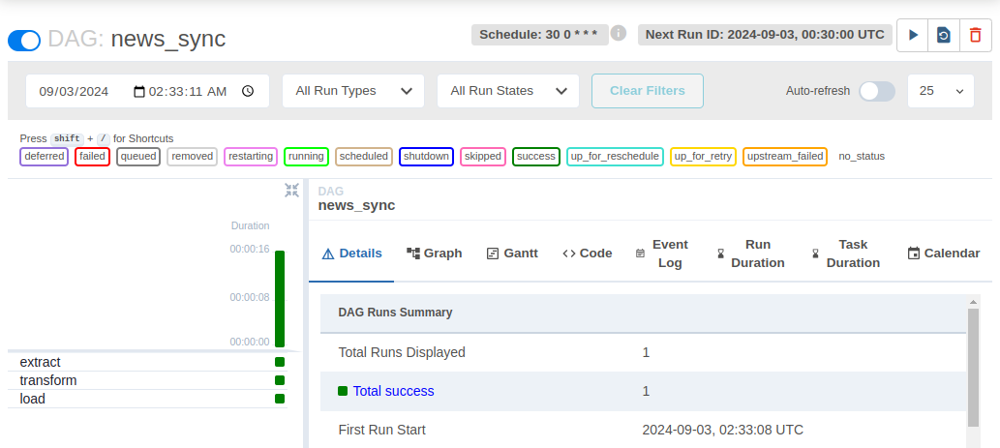
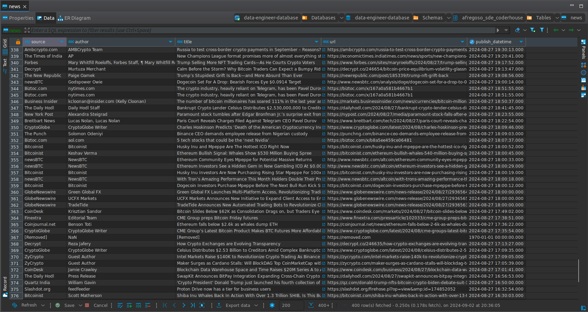

# Preentrega 03

## Requisitos
* Docker
* Base de datos en Redshift/Postgres
* Acceso a [newsapi.org](https://newsapi.org)

## Cómo ejecutar

1. Construye la imagen de Airflow la cual incluye los DAGs que vienen dentro de la carpeta [dags](dags).
```bash
docker build -t airflow-artorias .
```

2. Una vez que la imagen fue construida, rellena las variables de entorno en el archivo [docker-compose.yml](docker-compose.yml). Esta nos va a permitir extraer la información desde nuestro origen y persistir la información en una DB.
```yml
environment:
    - REDSHIFT_USER=${REDSHIFT_USER}
    - REDSHIFT_PASSWORD=${REDSHIFT_PASSWORD}
    - REDSHIFT_DATABASE=${REDSHIFT_DATABASE}
    - REDSHIFT_URL=${REDSHIFT_URL}
    - REDSHIFT_PORT=${REDSHIFT_PORT}
    - NEWS_API_KEY=${NEWS_API_KEY}
```

3. Levanta el contenedor de airflow con
```bash
docker compose up -d
```

4. Dirigete a la [interfaz web de Airflow](http://localhost:8080/dags/news_sync/grid) e inicia sesión.

5. Una vez logeado, dirigete al dag `news_sync` y enciendelo.

6. Una vez iniciado, este ejecutará la primera sincronización de datos hacía redshift, y a partir de ahí, se ejecutará todos los días a las 00:30 a.m. en horario UTC. La cual se encargará de almacenar todas las noticias de criptomodenas del día anterior.



## Datos resultantes
